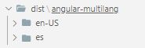
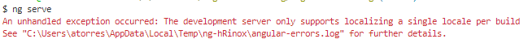
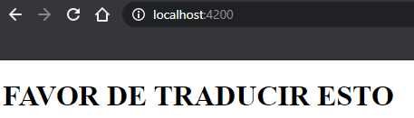
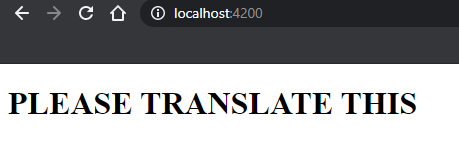

# Angular App in Multiple Languages
## To `Localize` your app follow the [i18n internationalization  official guideline in the Angular website](https://angular.io/guide/i18n)
1. Create the angular app
	```
	ng new localized-app
	```
2. Add _Internationalization (i18n)_ support
	```
	ng add @angular/localize
	```	
3. Add the ***i18n*** custom attribute to your text elements
	```
	<h1 i18n>PLEASE TRANSLATE THIS</h1>
	``` 
4. Extract the source language file into a dedicated folder using the xi18n command
	```
	ng xi18n --output-path src/locale
	```	
5. Verify that ***src/locale/messages.xlf*** was created	
6. Create a translation file for each language: copy messages.xlf and rename the copy by using the locale-id of the targeted language, for example, "es" stands for spanish:
	```
	messages.es.xlf	
	```
7. Open ***messages.es.xlf*** with a text editor (or with a xlf editor if you have one), you will see something like this
	```xml
	<?xml version="1.0" encoding="UTF-8" ?>
	<xliff version="1.2" xmlns="urn:oasis:names:tc:xliff:document:1.2">
	  <file source-language="en-US" datatype="plaintext" original="ng2.template">
	    <body>
	      <trans-unit id="0a5c022a373a53f84ed6feda3f87bfa8709104ba" datatype="html">
	        <source>PLEASE TRANSLATE THIS</source>
	        <context-group purpose="location">

	          <context context-type="sourcefile">src/app/app.component.html</context>
	          <context context-type="linenumber">1</context>
	        </context-group>
	      </trans-unit>
	    </body>
	  </file>
	</xliff>
	```	
8. Under the ***source*** element, create a ***target*** element and set its value to the translated text
	```xml
		...
	      <trans-unit id="0a5c022a373a53f84ed6feda3f87bfa8709104ba" datatype="html">
	        <source>PLEASE TRANSLATE THIS</source>
	        <target>FAVOR DE TRADUCIR ESTO</target>
			...
	      </trans-unit>
		...
	```	
9. Repeat this step for every text element that need to be translated
10. Open ***angular.json***, you will add an ***i18n*** configuration object in ***projects -> localized-app***
	```json
	...
	"projects": {
	  "localized-app": {
	    ...
	    "i18n": {
	      "sourceLocale": "en-US",
	      "locales": {
	        "es": "src/locale/messages.es.xlf"
	      }
	    },
	    "architect": {
	    ...
	    }
	}
	```
11. In ***angular.json*** add the ***localize = true*** configuration field into ***projects -> architect -> build -> options***	
	```
	...
		"build": {
		  "builder": "@angular-devkit/build-angular:browser",
		  "options": {
		    "localize": true,
		    "aot": true,
    ...
	```
12.	Build the project and get different versions of the deployed app for each language
	```
	ng build --localize
	```
13. Check your dist folder, you should see this:  
    
14. Try running the app
    ```
    ng serve
    ```    
15. You'll get an error   
            
    The angular guide says    
    > Due to the deployment complexities of i18n and the need to minimize rebuild time, the development server only supports localizing a single locale at a time. Setting the "localize" option to true will cause an error when using ng serve if more than one locale is defined. Setting the option to a specific locale, such as "localize": ["fr"], can work if you want to develop against a specific locale (such as fr).
17. Go back to ***angular.json***, and change the ***localize*** field we set on step 11 to an array with just one locale
    ```
	...
		"build": {
		  "builder": "@angular-devkit/build-angular:browser",
		  "options": {
		    "localize": ["es"],
		    "aot": true,
    ...    
    ```    
18. Try running the app again
    ```
    ng serve
    ```    
    
19. Change the value in ***localize*** to "[en-US]" and run the app again to see the result in english   
    ```        
        ...
        "build": {
        "builder": "@angular-devkit/build-angular:browser",
        "options": {
            "localize": ["es"],
            "aot": true,
        ...    
    ```        
    
19. You can create a custom locale-specific configuration so you don't have to change this value everytime, **[please see the guideline](https://angular.io/guide/i18n)**
20. For more advanced scenarios **[SEE THE ANGULAR GUIDELINE](https://angular.io/guide/i18n)**

## References
* https://angular.io/guide/i18n
* https://angular.io/guide/i18n
* https://angular.io/guide/i18n
* https://angular.io/guide/i18n
* https://angular.io/guide/i18n
* https://angular.io/guide/i18n